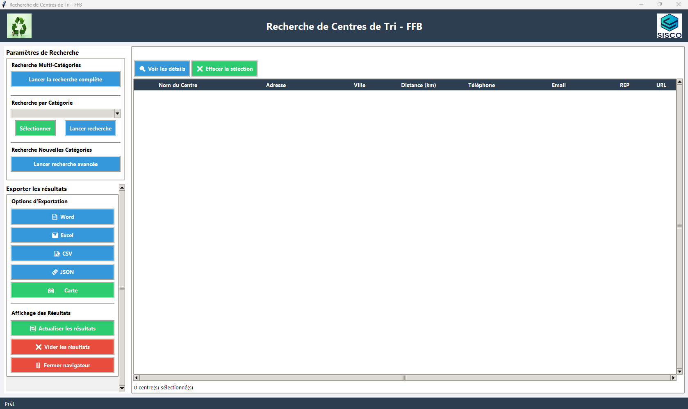
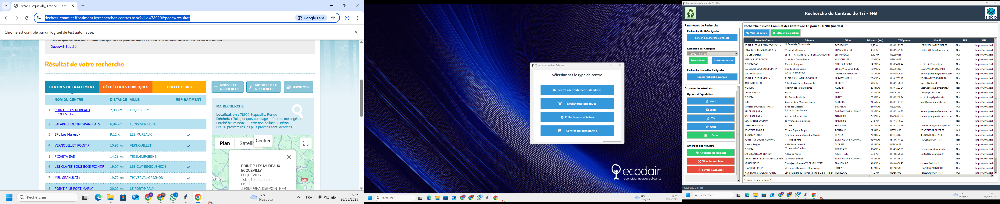

# 🏗️ Scraper Tri - Automatisation de la collecte des centres de tri BTP

[](https://www.python.org/)
[](https://selenium.dev/)
[](LICENSE)
[]()
[](https://krikounoureddine.github.io/Scraper-Tri/presentation/Rapport_Du_Projet.pdf)

- fichier de rapport du projet à telecharger "https://krikounoureddine.github.io/Scraper-Tri/presentation/Rapport_Du_Projet.pdf"


> Application desktop intelligente pour l'automatisation de la collecte et la gestion des données des centres de tri du BTP depuis la Fédération Française du Bâtiment.

## 📋 Table des Matières

- [🎯 Aperçu](#-aperçu)
- [🚀 Fonctionnalités](#-fonctionnalités)
- [🛠️ Installation](#️-installation)
- [💻 Utilisation](#-utilisation)
- [🏗️ Architecture](#️-architecture)
- [📊 Résultats](#-résultats)
- [🤝 Contribution](#-contribution)
- [📄 Licence](#-licence)

## 🎯 Aperçu

**Scraper Tri** est une application desktop développée dans le cadre d'un stage Master 2 à l'Université Paris VIII, en collaboration avec l'entreprise **SISCO**. Elle permet d'automatiser la recherche et la collecte des centres de tri de déchets de chantier référencés sur le site de la [FFB](https://www.dechets-chantier.ffbatiment.fr/).

### 📈 Problématique Résolue

[Difficultés rencontrées et solutions apportées](https://krikounoureddine.github.io/Scraper-Tri/presentation/Diagramme_difficultes_solutions.html)

[Arbre de décision des types de déchets](https://krikounoureddine.github.io/Scraper-Tri/presentation/Types_Dechets.html)


📊 Résultats

[Analyse comparative des performances ](https://krikounoureddine.github.io/Scraper-Tri/presentation/Manual_vs_Automated_Scraping.html)

| Avant Scraper Tri | Après Scraper Tri |
|-------------------|-------------------|
| ⏱️ 45 minutes par recherche | ⚡ 30 secondes |
| 📊 85% de précision | ✅ 99.2% de précision |
| 🗂️ 1 format manuel | 📤 5 formats automatisés |
| 🌐 Couverture limitée | 🗺️ France entière |

## 🚀 Fonctionnalités

[Diagramme de Flux Complet de l'Application Scraper Tri ](https://krikounoureddine.github.io/Scraper-Tri/presentation/Diagramme_de_flux_complet.html)

### 🔍 Recherche Intelligente
- **3 modes de recherche** : Simple, Multi-catégories, Avancée
- **Géolocalisation** : Recherche par ville, code postal, département
- **Filtres avancés** : 37 types de déchets répartis en 11 catégories
- **Validation automatique** des adresses et formats

### 🤖 Scraping Automatisé
- **Navigation Selenium** : Simulation réaliste du navigateur
- **Gestion ASP.NET** : Traitement des formulaires complexes
- **Parsing XML** : Extraction précise depuis les flux FFB
- **Gestion d'erreurs** : 28 cas d'erreur traités spécifiquement

### 💾 Gestion des Données
- **Base SQLite** : 2 bases optimisées (`centre_tri.db`, `centres_tri_complet.db`)
- **Dédoublonnage** : Prévention des doublons automatique
- **Historique** : Tracking complet des recherches
- **Structuration** : Modèle relationnel normalisé

### 📤 Export Multi-Formats
```python
# Formats supportés
exports = {
    "word": "Rapports formatés (.docx)",
    "excel": "Données tabulées (.xlsx)",
    "csv": "Interopérabilité (.csv)",
    "json": "API/Web (.json)",
    "carte": "Visualisation géographique (.html)"
}

[ Matrice des compétences développées](https://krikounoureddine.github.io/Scraper-Tri/presentation/Matrice_des_Competences_Developpees.html)

🎨 Interface Utilisateur

interface principal 



interface recherche



## 🛠️ Installation

### Prérequis
- 🐍 Python **3.11+**
- 🌐 Navigateur **Chrome** ou **Firefox**
- 💾 Au moins **500 Mo d’espace libre**

### Étapes
1. Téléchargez l’exécutable :  
   👉 [Selenium_Complet.exe](https://drive.google.com/file/d/1mH7IKtoTBw7Zf5FXtVDLgNtESUOTQg67/view?usp=drive_link)
2. Lancez-le directement (aucune installation requise).
3. Suivez les instructions du [Guide d’utilisation (PDF)](https://krikounoureddine.github.io/Scraper-Tri/presentation/Guide_Utilisation.pdf)

voisez les deux videox de démonstration
Vidéo Démonstration pour la recherche 1 (https://drive.google.com/file/d/1esJ-2XCAtanW2xPRC3Am0B8fDHZ6gi6E/view?usp=drive_link)
Vidéo Démonstration pour la recherche 2 (https://drive.google.com/file/d/1OtsWXWpxkqf0DvQ35szTjs_TA_FKltsU/view?usp=drive_link)

## 🧩 Technologies Utilisées

[Écosystème technologique maîtrisé](https://krikounoureddine.github.io/Scraper-Tri/presentation/Ecosysteme_Technologique_Maitris.html)


👥 Auteurs
Noureddine KRIKOU - Développement initial - GitHub Profile

Encadrement :

M. Nasreddine BOUHAÏ - Université Paris VIII

M. Moussa SISSOKO - SISCO

🙏 Remerciements
Équipe SISCO pour son accompagnement

Université Paris VIII pour le cadre académique

FFB pour la mise à disposition des données

## 📫 Contact

👤 **Noureddine KRIKOU**  
📧 [noureddine.krikou@example.com](mailto:noureddine.krikou@example.com)  
💼 [GitHub - KrikouNoureddine](https://github.com/KrikouNoureddine)  
🏫 Université Paris VIII — Stage chez **SISCO**

